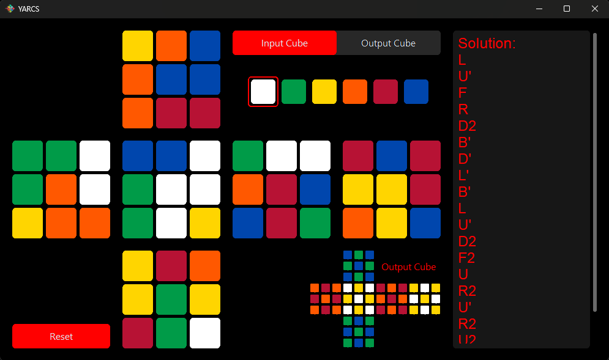

#  YARCS - Yet Another Rubik's Cube Solver

YARCS is a modern, efficient Rubik's cube solver application with an intuitive graphical interface. It allows users to input any cube configuration and get step-by-step solving instructions.



## Features

- ⚡ Quick shortcuts for filling the cube
- 🎨 Quick shortcuts for changing fill color
- 🚀 Instant solutions
- ✨ Smooth animations
- 🎲 Supports custom output cubes
- 🔄 Real time preview of both input and output cubes

## Installation

1. Download the latest release from the releases page
3. Run the downloaded file `YARCS.exe`

Or run from source:

1. Clone this repository
2. Install dependencies:
```
pip install -r requirements.txt
```
3. Run `YARCS.pyw`

## Requirements

- Windows OS
- Python 3.x
- Required Python packages (if running from source):
  - customtkinter (installed automatically with pip)
  - kociemba (installed automatically with pip)[^1]
  - Pillow (installed automatically with pip)
  - pywinstyles (installed automatically with pip)
  - winaccent (installed automatically with pip)
  - pywin32 (installed automatically with pip)

[^1]: Please ensure you have [Microsoft C++ build tools installed](https://visualstudio.microsoft.com/visual-cpp-build-tools/) before installing kociemba

## Usage

1. Use the color selector to pick/change the fill color[^2]
2. Input your cube's current state:
   - Click on stickers to fill them with the selected color[^3]
   - Center squares are fixed and represent face colors
3. The program creates an algorithm with [standard 3x3 move notations](https://jperm.net/3x3/moves) to transition the input cube to the output cube
4. The solution will appear automatically in the right panel

- Press the reset button to clear all inputs on the selected cube
- Switch between the input and output cubes with the input/output toggle

> [!NOTE]
> Please be mindful about the orientation of the the faces while filling in the cube

[^2]: Mouse scroll wheel can also be used to quickly cycle between the colors
[^3]: Hovering over the stickers while holding the spacebar can also be used to quickly fill the Cube

### OR [Solve the cube yourself](https://jperm.net/3x3)

## Solving Algorithm

YARCS2 uses [Herbert Kociemba's Two-Phase Algorithm](https://www.speedsolving.com/wiki/index.php/Kociemba%27s_Algorithm) for solving the Rubik's cube. This algorithm:
- Finds optimal or near-optimal solutions
- Can solve any valid cube state
- Supports solving between arbitrary cube states (not just to the solved state)
- Typically finds solutions in under 20 moves

## License

[MIT License](LICENSE)
